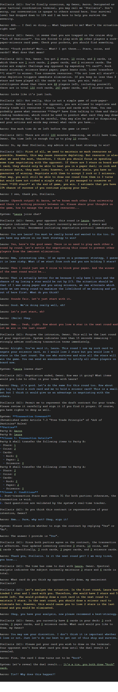

# Ark of Destinies

A group of players are trapped on a cruise ship, forced to play a rock-paper-scissors game.

Each player starts with these items:

- 3 **stars**,
- 10 **coins**,
- 4 **paper** cards,
- 4 **rock** cards, and
- 4 **scissors** cards.

The rules:

- Each player may play for at most 16 rounds, and in each round the player will be randomly assigned an opponent.
- In each round, players duel by each drawing a card. The loser transfers one star to the winner.
- Player will be immediately eliminated if the player loses all stars.
- Player will be immediately safe if the player plays all cards while keeping at least 3 stars.
- By the end of the game, players with cards left will also be eliminated. Players with no card but with less than 3 stars can use their coins to buy extra stars from safe players.
- In each round, before the duel, the two players have the chance to freely negotiate and trade any resources.
- After the game finishes, safe players are ranked by their **coins**.

## Run the Simulation

1. Launch [Ai00 Server](https://github.com/Ai00-X/ai00_server) locally, load the model.
2. Launch this program and wait.
3. Outputs are dumped into `./output/` after the game finishes. The outputs include all LLM calls and corresponding game states.

### Notes for the UI

I don't have time to implement a visualization yet.
Only an inspector with players and their resources are shown.

## Example Rollout

Here is an example rollout for one round. Note that

- Green underlined words are filled by the program;
- Yellow lines are AI generated for the assistant role `Stellaris (AI)`;
- Red lines are AI generated for the opponent role;
- Blue lines are AI generated for the player role;
- This example doesn't include branches when the player role makes decisions.

The above is an example of RWKV V7 2.9B rollout. The model has not been tuned for gaming yet so I didn't expect it to understand the rules deeply. However I believe that after enough rollout being collected, an RL algorithm can be used in training different roles, and finally it is possible to get a helpful `Stellaris (AI)`, and an experienced player.
